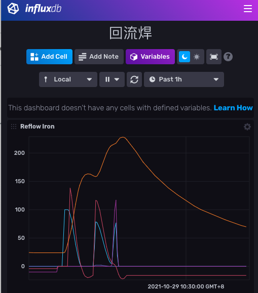
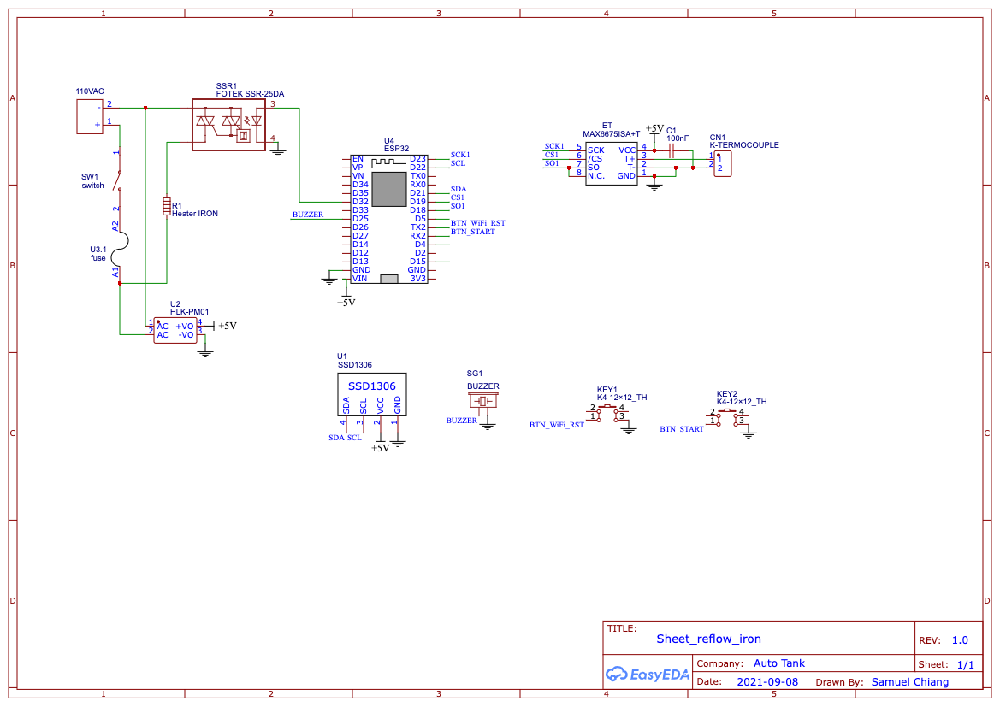
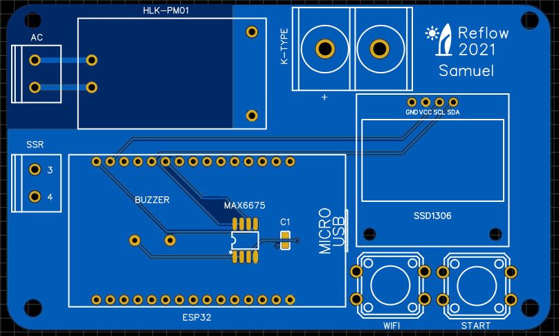
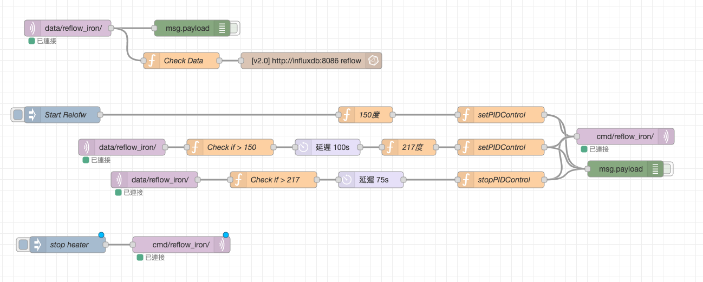

# ESP32_Reflow_Controller
Use ESP32 to control heater for reflow

## Features
- Use ESP32 as a micro controller.
- MAX6675 k-type thermocouple for temperature sensor.
- ESP32 output PWM to SSR for heater control.
- ESP32 use PID control.
- WiFi Button: Short pressed for switch WiFi on/off. Long pressed for reset WiFi AP.
- If WiFi is on, ESP32 can publish temperature and PWM Duty Ratio by MQTT. You can also send PID control command to ESP32.

## Result
Based on [Wikipedia Reflow](https://en.wikipedia.org/wiki/Reflow_soldering), I create a temperature curve as the following picture.

## Schematic Diagram

## PCB Design
Please refer to
[https://oshwlab.com/sychiang0318/reflow-hot-plate_copy](https://oshwlab.com/sychiang0318/reflow-hot-plate_copy)

## Open software
[ESP32 Reflow Controller](src/Reflow_Controller.ino)

## MQTT Data format
- Subscribe
  	- Topic
  		- `cmd/<DeviceId>/`
  	- Payload
		- Set PID Control Command
	  		- Example `{ "command": "setPIDControl", "params": { "temp": 120, "kp":2.5, "ki":0.06, "kd":0.8 }}`
		- Stop PID Control Command
	  		- Example `/{ "command": "stopPIDControl"}`
	
- Publish
	- Topic
		- `data/<DeviceId>/`
	- Payload
		- `{"Heater":<percent>,"Temp":<temperature>, "pid_p":<pid_p>,"pid_i":<pid_i>, "pid_d":<pid_d>}`

## Node-RED flow control
You can control the ESP32 by Node-RED flow through MQTT.

[Node-RED flow file](Node-RED_flow/nodered_reflow_flows.json)